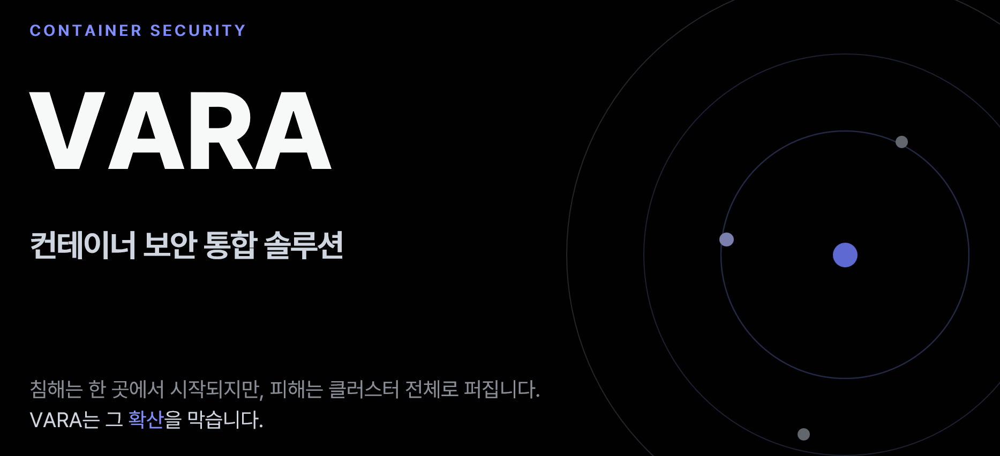
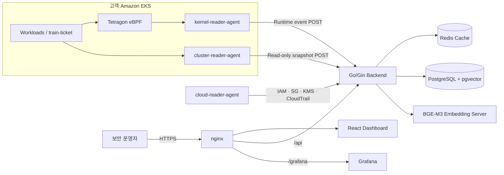

<!-- VARA HEADER -->


[](https://go.dev/)
[](https://react.dev/)
[](https://kubernetes.io/)
[](https://aws.amazon.com/)
[](https://www.docker.com/)
[](./public/openapi.yaml)

---

# VARA  
**컨테이너 보안 통합 솔루션 (Container Security & Blast Radius Analysis Platform)**  

쿠버네티스 환경의 취약점, 권한, 네트워크, 런타임 이벤트 및 컴플라이언스 정보를 하나의 그래프로 통합하고,  
특정 자산이 침해됐을 때 위험이 어디까지 확산되는지(Blast Radius)를 시각화하는 컨테이너 보안 플랫폼입니다.

- 서비스: [https://vara-security.com](https://vara-security.com)
- API 문서: [Swagger UI](https://vara-security.com/docs/)
- API 명세: [`public/openapi.yaml`](./public/openapi.yaml)

> VARA의 목표는 모든 침입을 완벽히 차단하는 것이 아니라,  
> **침해가 발생했을 때의 확산 범위를 빠르게 파악하고 가장 효과적인 차단 지점을 제시하는 것**입니다.

---

## 1. VARA 소개  

기존 컨테이너 보안 환경에서는 취약점 점수, 권한 분석, 규정 점검, 런타임 로그가 서로 다른 도구에 분산되어 있습니다.  
이로 인해 운영자는 수많은 경고를 직접 비교하며 우선순위를 판단해야 합니다.

**VARA**는 다음 네 단계를 하나의 플랫폼으로 통합합니다.

| 단계 | 역할 |
|------|------|
| 사전 | ISMS-P 및 보안 설정 자동 점검 |
| 인지 | 침해 시 확산 경로와 영향 범위 시각화 |
| 대응 | 위험 점수와 차단 효과를 기준으로 우선순위 제시 |
| 사후 | 조치 전후 점수·확산 반경 비교 및 운영 학습 |

---

## 2. 핵심 개념  

### Blast Radius

특정 Pod 또는 자산이 침해됐을 때 네트워크, 권한, 공급망 및 호스트 경로를 따라 위험이 퍼질 수 있는 범위를 의미합니다.

### 다중 레이어 보안 그래프

| 레이어 | 주요 관계 | 데이터 근거 |
|--------|-----------|-------------|
| Network | `connects_to`, `selected_by`, `allows`, `routed_by` | eBPF 통신, Service, NetworkPolicy, Ingress |
| Identity | `assumes`, `binds` | Pod → ServiceAccount → Role 권한 체인 |
| Supply Chain | `shares_cve` | 이미지·패키지 간 KEV/CVE 공유 |
| Host | `escape_path` | privileged, hostPath, hostNetwork 등 |

### 위험도 산정

VARA는 단순 CVSS가 아니라 다음 요소를 함께 반영합니다.

- **Global**: CVSS, EPSS, SSVC 기반 취약점 자체 위험도
- **Exposure**: LoadBalancer, Ingress, NetworkPolicy 기반 외부 노출도
- **Toxic Combination**: 외부 노출과 cluster-admin 등 위험 요소의 결합
- **ISMS-P 가산**: 규정 미준수 항목에 따른 추가 위험

```text
Global = (CVSS/10 × 0.4 + EPSS × 0.3 + SSVC × 0.3) × 100
Final  = clamp((Global × 0.7 + Exposure × 0.3) × Toxic + ISMS-P 가산, 0, 100)
```

| 등급 | 점수 |
|------|------|
| 긴급 | 75 이상 |
| 경고 | 50 이상 |
| 주의 | 25 이상 |
| 안전 | 25 미만 |

---

## 3. 주요 기능  

- **통합 보안 대시보드**: 긴급·경고·주의·안전 자산과 최우선 위험 Pod Top 5 제공
- **Blast Radius 시각화**: 선택 자산 침해 시 전파 범위와 확산 우선순위 표시
- **공격 경로(Kill Chain)**: 외부 진입점부터 핵심 자산까지의 고위험 경로 시각화
- **반응형 패치 시뮬레이션**: NetworkPolicy, RBAC, CVE 조치 적용 시 확산 반경과 점수 재계산
- **위험 점수 조정**: 조직 환경에 맞는 가중치 조정 및 AI 추천값 제공
- **신규 CVE 영향도 매핑**: SBOM·PURL·OSV 데이터를 이용해 영향받는 Pod 즉시 식별
- **RBAC 권한 상승 분석**: 15개 룰과 고정점 분석으로 cluster-admin 도달 가능 ServiceAccount 탐지
- **AWS IAM 권한 상승 분석**: 위험 권한 조합을 기반으로 관리자급 상승 가능 principal 탐지
- **ISMS-P 자동 점검**: 21개 항목·103개 룰을 충족·미충족·확인불가로 판정
- **런타임 이상 탐지**: eBPF 이벤트에 규칙, Isolation Forest, 선언-관측 drift 분석 적용
- **자산 카탈로그**: 자산의 영향도와 위험도를 4사분면으로 분류
- **알림 및 자동화**: 신규 CVE·스캔 결과 알림과 Slack Webhook 연동
- **폐쇄망 지원**: 외부 취약점 DB를 로컬로 내려받아 오프라인 매칭 가능

> 🔐 **수집 원칙**  
> 모든 에이전트는 읽기 전용으로 동작하며, Kubernetes Secret의 실제 값은 수집하지 않습니다.  
> 클러스터에서 백엔드로 단방향 전송하고, 관리 기능은 JWT와 MFA로 보호합니다.

---

## 4. 시스템 구성 및 데이터 흐름  



VARA의 데이터는 다음 순서로 처리됩니다.

1. **수집**: Kubernetes 설정·RBAC·런타임 통신·AWS 설정을 읽기 전용으로 수집
2. **적재**: PostgreSQL의 정규화 테이블, JSONB 및 pgvector에 저장
3. **분석**: 스케줄러가 위험 점수, 확산 경로, 권한 상승, 이상 탐지를 사전 계산
4. **캐시**: 주요 분석 결과를 Redis에 저장해 조회 지연 최소화
5. **제공**: 대시보드와 REST API가 사전 계산된 결과를 조회

---

## 5. 실행 가이드  

### 1) 사전 요구사항

- Docker 및 Docker Compose
- Go 개발 환경
- Node.js 및 npm
- Kubernetes 클러스터 또는 Amazon EKS
- Helm
- PostgreSQL 16 및 Redis 또는 Docker 기반 실행 환경

### 2) 버전 확인

```bash
docker --version
docker compose version
go version
node --version
npm --version
kubectl version --client
helm version
```

### 3) 프론트엔드 빌드

```bash
npm install
npm run build
```

빌드 결과인 `dist/` 디렉터리는 nginx에서 정적 파일로 제공합니다.

### 4) 백엔드·데이터베이스 실행

```bash
docker compose up -d
```

백엔드는 기본적으로 `:8080`, PostgreSQL은 `:5432`, Redis는 `:6379`에서 동작하도록 구성합니다.  
운영 환경에서는 `.env` 또는 Secret Manager를 사용해 데이터베이스 접속 정보와 인증 키를 주입해야 합니다.

### 5) VARA 에이전트 배포

```bash
helm install vara-platform <chart-path> \
  --namespace vara-system \
  --create-namespace
```

- `cluster-reader-agent`: Kubernetes 구성·권한 API 폴링
- `kernel-reader-agent`: Tetragon 이벤트 전처리 및 전송
- `cloud-reader-agent`: AWS IAM·SG·KMS·CloudTrail 설정 수집

### 6) 서비스 접속

| 구분 | 기본 경로 |
|------|-----------|
| 웹 대시보드 | `https://<domain>/` |
| REST API | `https://<domain>/api/` |
| Swagger UI | `https://<domain>/docs/` |
| Grafana | `https://<domain>/grafana/` |

### 트러블슈팅

| 문제 상황 | 확인 사항 |
|-----------|-----------|
| 그래프 데이터가 갱신되지 않음 | 마이그레이션 적용 여부와 `schema_migrations` 확인 |
| Pod 간 통신이 Service IP로만 표시됨 | ClusterIP → Pod 역매핑 데이터와 eBPF 후킹 위치 확인 |
| NetworkPolicy와 실제 통신이 다름 | CNI의 NetworkPolicy 강제 여부와 drift 경고 확인 |
| 이상 탐지 결과가 정상으로 학습됨 | 학습 데이터 동결 여부와 주입 데이터 제거 여부 확인 |
| 그래프가 지나치게 복잡함 | 전체 그래프 대신 위험 자산 중심 오비탈 뷰 사용 |
| 분석 API 응답이 느림 | AnalysisScheduler 실행 상태와 Redis 캐시 확인 |

---

## 6. 개발자 환경 세팅  

### Frontend

```bash
npm install
npm run build
```

주요 기술: React 18, Vite 5, TypeScript, Tailwind CSS, Cytoscape.js, D3, Recharts

### Backend

```bash
# 의존성 정리
go mod download

# 서버 빌드
go build ./cmd/server

# 테스트
go test ./...
```

주요 기술: Go, Gin, gonum, PostgreSQL 16, pgvector, Redis

### Database Migration

```bash
# 예시: golang-migrate 사용
migrate -path ./migrations \
  -database "$DATABASE_URL" up
```

> 스키마 변경은 수동 SQL 대신 마이그레이션 파일로 관리하고,  
> 백엔드가 시작되기 전에 미적용 마이그레이션이 먼저 실행되도록 구성합니다.

### 개발 환경 변수 예시

```dotenv
DATABASE_URL=postgres://<user>:<password>@<host>:5432/<database>?sslmode=disable
REDIS_ADDR=<host>:6379
JWT_SECRET=<replace-with-secure-secret>
AWS_REGION=ap-northeast-2
```

실제 변수명은 각 저장소의 설정 파일과 배포 환경을 기준으로 조정해야 합니다.

---

## 7. 소스 구조  

### Frontend

```text
src/
├─ App.tsx, main.tsx
├─ components/
│  ├─ Header, Sidebar, AppShell
│  └─ pages/                # risk, ismsp, runtime, assets, toxic, notifications
├─ blast-v2/
│  ├─ BlastRadiusV2.tsx
│  ├─ orbital/              # OrbitalView, PathFlowView, chokePoints
│  └─ rbac/                 # RbacPanel
├─ api/                     # REST API client
├─ data/                    # mock fallback data
├─ hooks/ · utils/ · types/
├─ pages/                   # Login
└─ styles/

public/
├─ openapi.yaml
└─ docs/
```

### Backend

```text
cmd/server/                 # 애플리케이션 엔트리
internal/
├─ server/                  # HTTP server, router, mTLS
├─ handler/                 # REST API handler
├─ service/                 # 비즈니스 로직
├─ domain/
│  └─ scoring/              # global, exposure, toxic, final, attack path
├─ repository/
│  ├─ postgres/
│  └─ vector/               # pgvector
├─ platform/                # Redis, K8s, eBPF, NVD, EPSS, KEV, OSV, Trivy 등
├─ rbacchain/
│  └─ fixpoint/             # 권한 상승 고정점 엔진 및 룰셋
└─ scheduler/               # 분석·취약점 스케줄러

rulesets/                   # ISMS-P JSON 룰셋
migrations/                 # DB 마이그레이션
api/openapi.yaml            # OpenAPI 3.1 명세
embedding-server/           # BGE-M3 임베딩 서버
```

---

## 8. 검증 결과  

실제 Amazon EKS의 `train-ticket` 마이크로서비스 환경에서 수집부터 분석·시각화까지 전체 파이프라인을 검증했습니다.

| 항목 | 결과 |
|------|------|
| 기능 테스트 | 25개 테스트 케이스 통과 |
| 런타임 이상 탐지 | 외부 egress, IMDS 접근, 비정상 DB 접근, 의심 프로세스, 신규 통신 엣지 탐지 |
| 신규 CVE 영향도 매핑 | 약 90% 수준 확인 |
| 패치 시뮬레이션 | 최종 점수 90(긴급) → 0(안전) 감소 사례 검증 |
| RBAC 분석 | 85개 SA 중 cluster-admin 도달 가능 11개 식별 |
| ISMS-P 점검 | 충족 11건, 미충족 6건, 확인불가 3건 |
| 에이전트 자원 사용 | t3.xlarge 기준 노드 CPU 약 2%, 메모리 약 1% |
| Monte Carlo | 6,000회 반복에서 약 ±0.2% 수준으로 수렴 |

---

## 9. 기여 (Contributing)  

VARA 프로젝트에 기여할 때는 기능 단위 브랜치와 Conventional Commits 사용을 권장합니다.

```bash
# 1. 기능 브랜치 생성
git checkout -b feature/기능명

# 2. 변경사항 커밋
git commit -m "feat: 기능 요약"

# 3. 원격 저장소에 푸시
git push origin feature/기능명
```

**권장 규칙**

- API 변경 시 `openapi.yaml`을 함께 수정합니다.
- DB 스키마 변경은 반드시 `migrations/`에 추가합니다.
- 위험 점수·권한 상승 룰을 수정할 때는 근거 표준과 테스트 케이스를 함께 남깁니다.
- Secret, Webhook URL, 인증 키 및 운영 계정 정보는 커밋하지 않습니다.

---

## 10. 오픈소스 라이선스  

VARA에서 팀이 직접 작성한 소스코드는 [MIT License](./LICENSE) 하에 배포됩니다.  
외부 오픈소스 구성 요소는 각각의 원 라이선스를 따르며, 세부 고지 사항은 [`THIRD_PARTY_LICENSES.md`](./THIRD_PARTY_LICENSES.md)에서 확인할 수 있습니다.

| 구성 요소 | 용도 | 라이선스 |
|-----------|------|----------|
| React · Vite | 프론트엔드 | MIT |
| Cytoscape.js | 그래프 시각화 | MIT |
| D3 · Recharts | 차트·시각화 | ISC / MIT |
| Go · Gin | 백엔드 | BSD-3-Clause / MIT |
| gonum | 그래프 알고리즘 | BSD-3-Clause |
| PostgreSQL · pgvector | 데이터베이스·벡터 검색 | PostgreSQL License |
| Redis | 분석 결과 캐시 | 사용 버전에 따라 상이 |
| Tetragon | eBPF 관측 | Apache-2.0 |
| nginx | 웹 서버·리버스 프록시 | BSD-2-Clause |
| certbot | TLS 인증서 자동화 | Apache-2.0 |

### 시험 및 검증 환경

| 구성 요소 | 용도 | 라이선스 |
|-----------|------|----------|
| train-ticket | 마이크로서비스 시험 대상 워크로드 | Apache-2.0 |

> 외부 구성 요소의 소스코드 또는 배포물을 포함하는 경우 해당 저작권 고지, 라이선스 전문 및 `NOTICE` 요구사항을 유지해야 합니다.

---

## 11. License Summary  

- **Main Project:** MIT License (TEAM VARA)
- **Third-party Components:** MIT, ISC, BSD, Apache-2.0, PostgreSQL License 등
- **Distribution:** VARA 자체 코드는 사용·수정·배포·상업적 이용 가능
- **Obligation:** 원저작권 및 MIT License 전문 유지, 외부 구성 요소의 개별 라이선스 준수
- **Security Requirement:** 인증정보·Webhook·클라우드 키를 소스와 배포물에서 분리

---

### VARA — 취약점 목록에서, 확산을 막는 의사결정으로  
한 번의 침해가 어디까지 번지는지 파악하고, 가장 효과적인 차단 지점부터 대응하세요.
